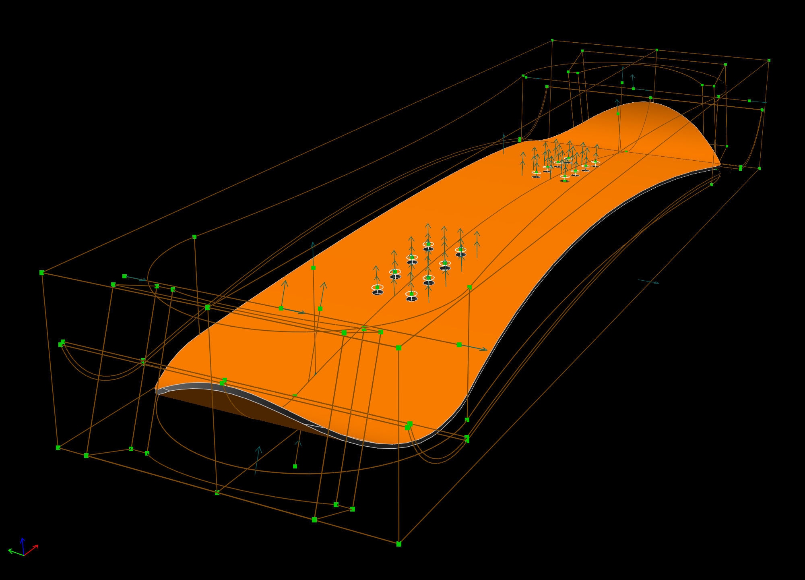
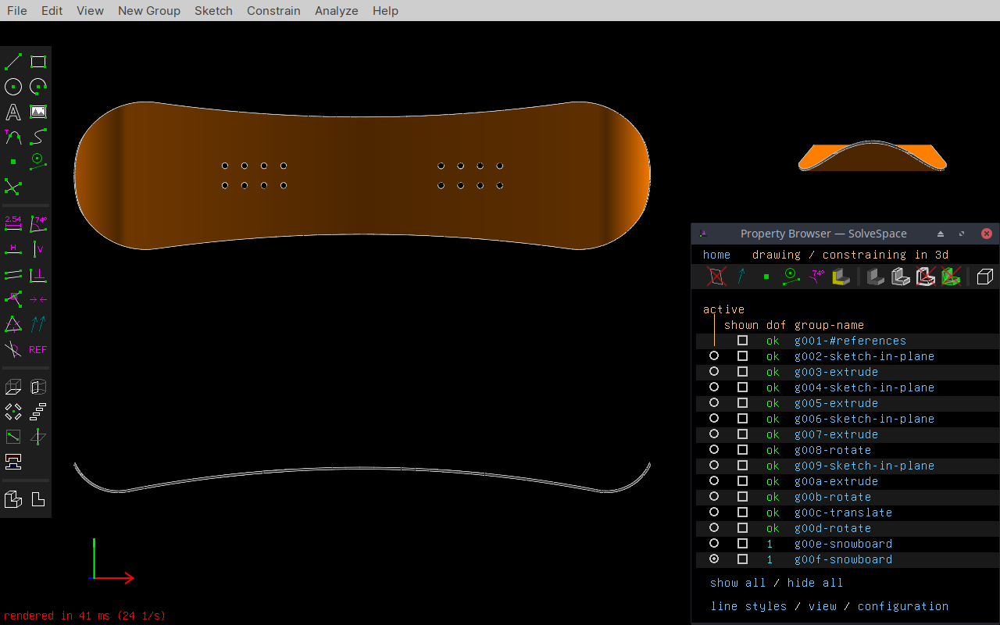

# SolveSpace Daily Engineering 

> **DONATE Bitcoin** (BTC): `1LoE44kuRsS3cfjyCytnVjn5vGH9F3jyY7`

This is repository of [👷 `@app4soft`](https://twitter.com/app4soft)'s engineering experiments in [*SolveSpace*](https://solvespace.com) — FLOSS 2D/3D CAD &amp; CAE.

## SolveSpace 3.x (.slvs)

For use `.slvs` files from this repository you should install latest nightly version of *SolveSpace* `3.x`!

- Build it from [latest sources](https://github.com/solvespace/solvespace) (maintained by [@whitequark](https://github.com/whitequark)) 
  - [Nightly builds for Windows](https://ci.appveyor.com/project/whitequark/solvespace/build/artifacts) (official EXE builds on AppVeyor CI)
  - [Nightly builds for Linux](https://notesalexp.org) (unofficial [@AlexanderP](http://github.com/alexanderp)'s PPA for Debian/Ubuntu) 
  - [Nightly builds for Mac OS](https://github.com/vespakoen/solvespace/releases/tag/3.0-vespakoen) (unofficial [@vespakoen](https://github.com/vespakoen)'s DMG builds)

## Projects

> **NOTE**: Each project directory include at least *SolveSpace* files (`.slvs`), exported image with perspective view  and screenshot with 3-view (`.png`).
>
> Some projects may or may not include *STEP* (`.stp`/`.step`), *DXF* and *PDF* files.

| Project / Directory | Preview | Reference |
| :----: | :----: | ---- |
| [snowboard](./snowboard) |   | Inspired by samples from [BoardCAM](https://github.com/BoardCAM/BoardCAM) - FLOSS snowboard CAD & CAM |

## LICENSE

> 
>
> This work is licensed under a <a rel="license" href="http://creativecommons.org/licenses/by-sa/4.0/">Creative Commons Attribution-ShareAlike 4.0 International License</a>.
